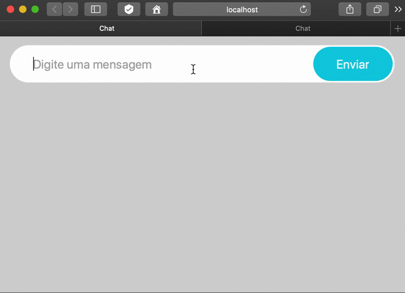

# CHAT COM WEBSOCKETS
👨‍🏫PROJETO CRIADO PARA O CURSO WEBSOCKETS!

 <br>  

## DESCRIÇÃO:
Este aplicativo de chat oferece uma interface simples e intuitiva para os usuários se comunicarem. Essa é uma ótima maneira de aprender sobre WebSockets e como criar aplicações interativas em tempo real.

## FUNCIONALIDADES:
1. **Envio de Mensagens**
   - **Campo de Texto**: Os usuários podem digitar suas mensagens no campo de texto.
   - **Botão Enviar**: Após digitar a mensagem, o usuário pode clicar no botão "Enviar" para enviar a mensagem ao chat.

2. **Exibição de Mensagens**
   - **Área de Chat**: As mensagens enviadas pelos usuários são exibidas em uma área dedicada na interface do chat, permitindo que todos os participantes vejam as mensagens em tempo real.

3. **Indicação de Digitando**
   - **Status de Digitando**: O aplicativo pode mostrar uma indicação de que um usuário está digitando, o que melhora a experiência de comunicação ao informar os participantes que uma nova mensagem está sendo escrita.

## EXECUTANDO O PROJETO:
1. **Instalando as Dependências:**
   - Para instalar as dependências listadas no arquivo "package.json", você pode usar o comando `npm install` no terminal. Certifique-se de estar no diretório `CODIGO/`:
   ```bash
   npm install
   ```

2. **Executando o Aplicativo:**
   - Para iniciar o servidor, você deve estar no diretório `CODIGO/` e execute o seguinte comando:
   ```bash
   npm start
   ```

   - Acesse o aplicativo no navegador visitando [http://localhost:8080](http://localhost:8080).

3. **Interagindo com o Aplicativo:**
   1. **Digite uma Mensagem**
      - Clique no campo de texto onde está escrito "Digite uma mensagem...".
      - Digite sua mensagem.

   2. **Enviar a Mensagem**
      - Após digitar a mensagem, clique no botão "Enviar" ao lado do campo de texto.
      - A mensagem será enviada e aparecerá na área de chat junto com as mensagens dos outros usuários.

   3. **Visualizar Mensagens**
      - Todas as mensagens enviadas pelos participantes serão exibidas na área de chat, permitindo a comunicação em tempo real.

   4. **Verificar Status de Digitando**
      - Se outro usuário estiver digitando, uma indicação visual será mostrada, informando que uma nova mensagem está a caminho.

## NÃO SABE?
- Entendemos que para manipular arquivos em `HTML`, `CSS` e outras linguagens relacionadas, é necessário possuir conhecimento nessas áreas. Para auxiliar nesse aprendizado, oferecemos cursos gratuitos disponíveis:
* [CURSO DE HTML E CSS](https://github.com/VILHALVA/CURSO-DE-HTML-E-CSS)
* [CURSO DE JAVASCRIPT](https://github.com/VILHALVA/CURSO-DE-JAVASCRIPT)
* [CURSO DE NODEJS](https://github.com/VILHALVA/CURSO-DE-NODEJS)
* [CURSO DE EXPRESSJS](https://github.com/VILHALVA/CURSO-DE-EXPRESSJS)
* [CURSO DE JQUERY](https://github.com/VILHALVA/CURSO-DE-JQUERY)
* [CONFIRA MAIS CURSOS](https://github.com/VILHALVA?tab=repositories&q=+topic:CURSO)

## CREDITOS:
- [PROJETO CRIADO PARA O CURSO WEBSOCKETS](https://github.com/VILHALVA/CURSO-DE-WEBSOCKETS)
- [PROJETO FEITO PELO VILHALVA](https://github.com/VILHALVA)


